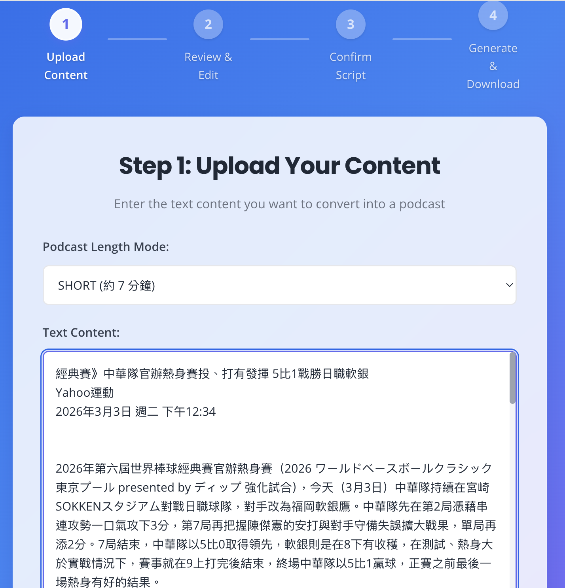
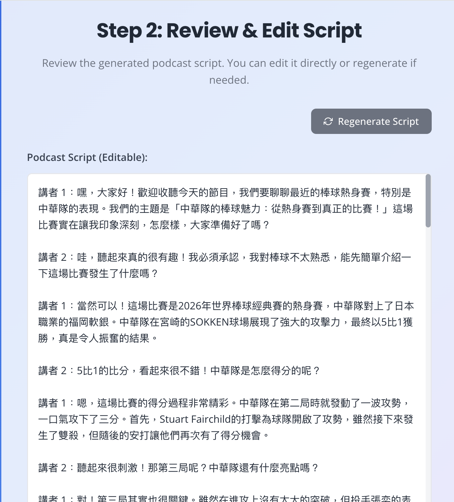
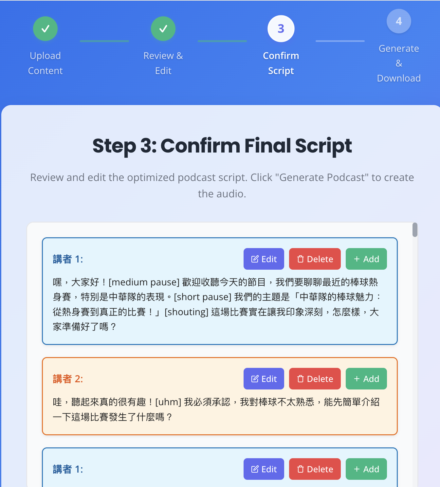
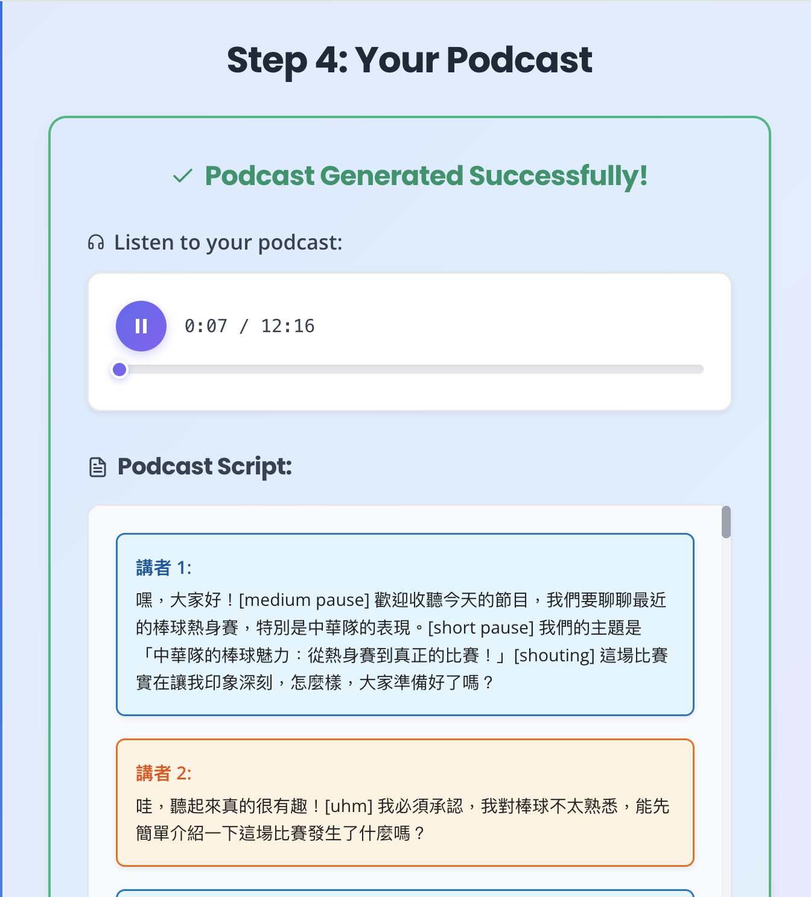
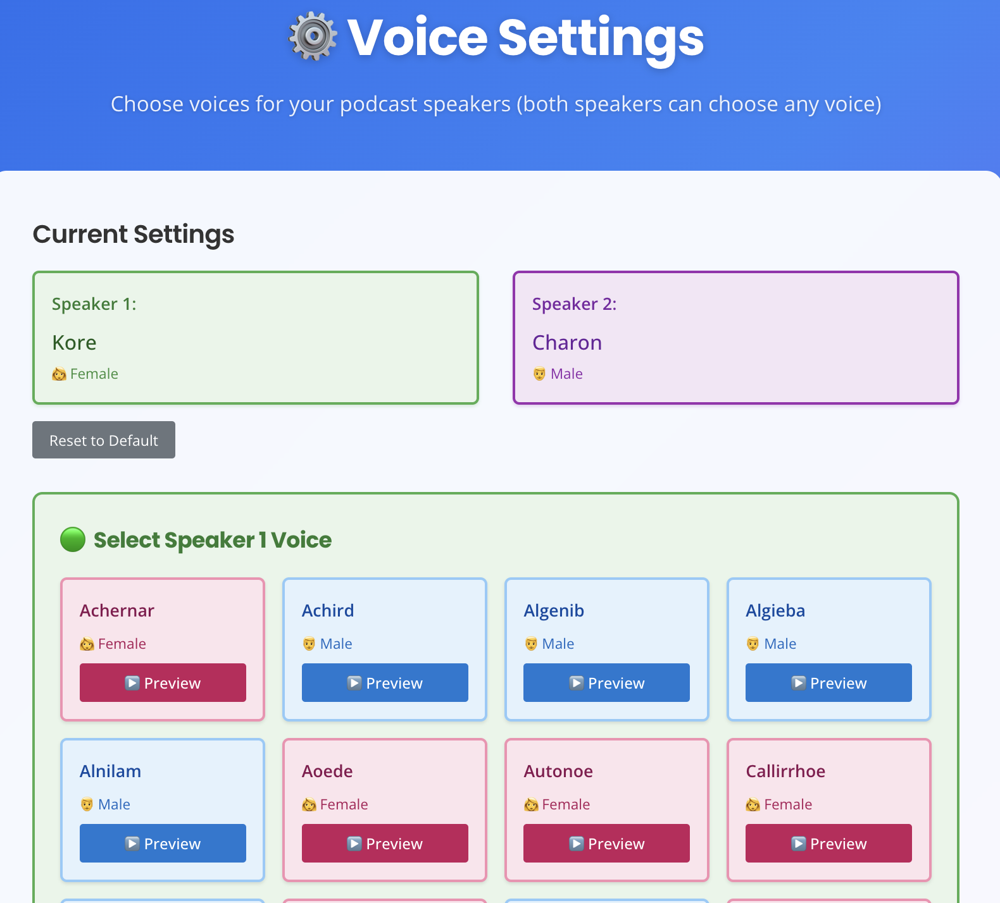

# Text2Podcast - Podcast 生成工具

一個全端 Podcast 生成應用程式，可從文字內容自動生成專業的 Podcast 音訊。使用 AI 技術將文字轉換為自然流暢的對話式 Podcast，支援多種長度模式和語音設定。

## ✨ 功能特色

- 📝 **智能轉錄生成**：使用 LLM 將文字內容轉換為自然的 Podcast 對話稿，**預設使用 Gemini**（`LLM_PROVIDER=gemini`），也可切換回 OpenAI（`LLM_PROVIDER=openai`）
- 🎙️ **多種長度模式**：支援 SHORT（7 分鐘）、MEDIUM（15 分鐘）、LONG（30 分鐘）
- 🔊 **高品質語音合成**：使用 Google Cloud TTS 生成自然語音（固定使用 Google，非可選項），模型由 `TTS_MODEL` 指定
- 🎭 **雙講者對話**：支援兩個不同角色的講者進行對話
- 🎨 **現代化 Web 介面**：React + TypeScript 建構的直觀使用者介面
- 📊 **即時進度追蹤**：透過 Server-Sent Events (SSE) 即時顯示處理進度
- 💾 **完整輸出管理**：自動合併音訊檔案並提供下載功能

## 🤖 使用了哪些 AI 服務？

本專案使用**兩個獨立的 AI 服務**，分別負責不同工作，**兩者都是 Google／OpenAI 這類第三方 API，不是同一個服務**：

| 工作 | 服務 | 對應程式 | 所需憑證 |
| --- | --- | --- | --- |
| **腳本生成**（Step 1 產生逐字稿、Step 2 優化為講者分段） | **可切換**：預設 **Gemini**，也可設定 `LLM_PROVIDER=openai` 改用 **OpenAI** | `backend/app/services/llm/` | Gemini：`GEMINI_API_KEY`（或改用 Vertex AI：`GOOGLE_CLOUD_PROJECT` + 既有的 `GOOGLE_APPLICATION_CREDENTIALS`）。OpenAI：`OPENAI_API_KEY`（僅在 `LLM_PROVIDER=openai` 時需要） |
| **語音合成**（Step 3 文字轉語音） | **固定為 Google Cloud TTS**（模型由 `TTS_MODEL` 指定，預設 `gemini-3.1-flash-tts-preview`），供應商不受 `LLM_PROVIDER` 影響，也無法切換 | `backend/app/services/audio_service.py` | `GOOGLE_APPLICATION_CREDENTIALS`（Google Cloud 服務帳戶金鑰） |

也就是說：**預設情況下（`LLM_PROVIDER` 未設定 = `gemini`），整個專案只需要 Google 憑證即可運作**，不再強制要求 OpenAI API Key。完整環境變數說明見 [`.env.example`](.env.example)。

## 🖼️ 功能截圖

以下為各步驟與設定頁的畫面說明與截圖（圖片位於 `images/`）。

### Step 1：上傳內容

- **路徑**：`/`
- **功能**：輸入或貼上欲轉成 Podcast 的文字，選擇長度模式（SHORT / MEDIUM / LONG），點擊「開始生成」後由後端產生初始轉錄稿並跳轉至 Step 2。



### Step 2：檢視與編輯轉錄稿

- **路徑**：`/edit/:taskId`
- **功能**：檢視 AI 生成的雙講者對話稿，可直接編輯文字或點擊「重新生成」再產生一版。確認後進入 Step 3 進行優化。



### Step 3：確認腳本與語音

- **路徑**：`/confirm/:taskId`
- **功能**：檢視優化後的逐句腳本（Speaker 1 / Speaker 2），可單句編輯、刪除或插入新句。確認語音設定後點擊「開始生成音訊」進入 Step 4。



### Step 4：生成與下載

- **路徑**：`/result/:taskId`
- **功能**：透過 SSE 即時顯示合成進度；完成後可試聽、下載合併後的 MP3 及轉錄稿（PDF），或「建立新 Podcast」回到 Step 1。



### 設定頁：語音選擇

- **路徑**：`/settings`
- **功能**：為 Speaker 1、Speaker 2 選擇 TTS 語音，可試聽（Preview）、重置為預設、返回首頁。



## 🏗️ 專案架構

```
Text2Podcast/
├── backend/              # FastAPI 後端服務
│   ├── app/
│   │   ├── api/         # API 路由
│   │   ├── models/      # 資料模型
│   │   ├── prompts.py   # Prompt 模板（供應商無關）
│   │   ├── services/    # 業務邏輯服務
│   │   │   ├── llm/     # LLM 供應商實作（Gemini 預設／OpenAI 可選）
│   │   │   └── ...      # audio_service、task_manager、transcript_service
│   │   └── utils/       # 工具函數
│   ├── outputs/         # 生成的輸出檔案
│   └── uploads/         # 上傳的檔案
├── frontend/            # React 前端應用
│   ├── src/
│   │   ├── components/  # React 元件
│   │   ├── pages/       # 頁面元件
│   │   ├── services/    # API 服務
│   │   └── contexts/    # React Context
│   └── public/          # 靜態資源
├── scripts/legacy/      # 早期命令列腳本，僅供參考，不在維護與 CI 範圍內
├── src/
│   └── prompt.py        # 向後相容 shim，實際 Prompt 模板已移至 backend/app/prompts.py
├── example/             # 範例轉錄稿
├── images/              # README 截圖
└── .env.example         # 完整環境變數說明
```

## 🚀 快速開始

### 前置需求

- Python 3.11+
- Node.js 20.19+ 或 22.12+（Vite 8 與 ESLint 10 的最低需求，Node 16／18 無法安裝）
- **ffmpeg**（後端合併音訊片段時會直接呼叫 `ffmpeg` 執行檔，需安裝並在 `PATH` 中可找到）
- Google Cloud 專案與服務帳戶金鑰（`GOOGLE_APPLICATION_CREDENTIALS`）：**必要**，用於語音合成（TTS API，固定使用 Google）
- Gemini API Key（`GEMINI_API_KEY`，或改用 Vertex AI）：**預設腳本生成所需**（`LLM_PROVIDER=gemini`，預設值）
- OpenAI API Key：**僅在**將 `LLM_PROVIDER` 改設為 `openai` 時才需要，預設不需要

詳見上方「使用了哪些 AI 服務？」與 [`.env.example`](.env.example)。

### 後端設定

1. **安裝依賴套件**

```bash
cd backend
pip install -r requirements.txt
```

`backend/requirements.txt` 中每個直接依賴都已釘選為明確版本號。

2. **設定環境變數**

建立 `.env` 檔案在 `backend/` 目錄下（**預設**：`LLM_PROVIDER=gemini`，腳本生成與語音合成都只需要 Google 憑證）：

```env
GOOGLE_APPLICATION_CREDENTIALS=path/to/your/service-account-key.json
GEMINI_API_KEY=your_gemini_api_key
```

或使用環境變數：

```bash
export GOOGLE_APPLICATION_CREDENTIALS=path/to/your/service-account-key.json
export GEMINI_API_KEY=your_gemini_api_key
```

若想改用 OpenAI 生成腳本（語音合成仍固定為 Google TTS），另外設定：

```env
LLM_PROVIDER=openai
OPENAI_API_KEY=your_openai_api_key
```

完整環境變數清單（含 `LLM_PROVIDER`、`GEMINI_MODEL`、`GOOGLE_CLOUD_PROJECT`／
`GOOGLE_CLOUD_LOCATION`（Vertex AI 備援）、`OPENAI_MODEL`、`CORS_ALLOW_ORIGINS`、
`API_KEY`、速率限制與 TaskManager 逾時等可選設定）請見專案根目錄的
[`.env.example`](.env.example)，以及 [`backend/README.md`](backend/README.md) 中的說明。

3. **啟動後端服務**

```bash
cd backend
uvicorn app.main:app --reload --host 0.0.0.0 --port 8000
```

⚠️ **重要：後端目前僅支援單一 process 執行**（`TaskManager` 是 process 內的
記憶體儲存，未跨 process 共享），請勿使用 `--workers` 啟動多個 worker，否則
任務狀態查詢與 SSE 進度串流會不穩定。詳見 [`backend/README.md`](backend/README.md)。

後端服務將在以下位置可用：
- API: http://localhost:8000
- API 文件: http://localhost:8000/docs
- 健康檢查: http://localhost:8000/health

### 前端設定

1. **安裝依賴套件**

```bash
cd frontend
npm install
```

2. **設定環境變數（可選）**

建立 `.env` 檔案在 `frontend/` 目錄下：

```env
VITE_API_URL=http://localhost:8000
```

3. **啟動開發伺服器**

```bash
npm run dev
```

前端應用將在 http://localhost:3000 可用

4. **建置生產版本**

```bash
npm run build
npm run preview
```

## 🧪 測試

### 前端測試

前端使用 **Vitest** + **React Testing Library** + **jsdom**（與 Vite 專案天然搭配，
不需另外設定轉譯工具）。測試檔與被測檔案同層，以 `*.test.ts(x)` 命名。

```bash
cd frontend
npm test          # 執行一次（CI 用）
npm run test:watch  # 監看模式，開發時使用
```

目前涵蓋幾個實際出過狀況、值得釘住行為的地方，而非追求覆蓋率：

- `src/services/api.ts` 的 `getErrorMessage`：後端 `detail` 訊息、非 axios 錯誤、
  格式不正確的回應，三種情況各自的降級行為
- `src/data/tonePresets.ts`：每個語氣預設都能解析出非空 prompt，`natural` 為預設，
  未知 id 不會拋例外
- `src/components/Step4Result.tsx` 的**部分失敗警告**（`partial: true`
  時）：警告需標示失敗與總片段數、不得同時顯示「成功」狀態、下載仍可正常使用，
  且警告以文字標籤與 `role="alert"` 傳達，不只靠顏色區分
- `src/components/SegmentList.tsx`：失敗片段有視覺區分、「只顯示失敗片段」篩選
  正常運作、重新生成中會鎖住其他重新生成按鈕（避免重複呼叫 TTS 而多收費）
- `src/hooks/useProgress.tsx`：SSE 事件的 `total_segments`／`failed_segments`／
  `partial` 欄位正確帶出、串流網址來自 `podcastApi.getProgressStreamUrl`
  （而非寫死的 host——這曾是真的 bug）

所有測試皆為確定性（deterministic），不會真的發送網路請求（`../services/api`
與 `EventSource` 皆以 mock/stub 取代）。

### 後端測試

後端使用 **pytest**，測試依賴另外釘選於 `backend/requirements-dev.txt`（與
`requirements.txt` 分開，正式環境不需要安裝）：

```bash
cd backend
pip install -r requirements.txt -r requirements-dev.txt
pytest
```

詳見 `backend/pytest.ini` 與 `backend/tests/`。

### CI

`.github/workflows/ci.yml` 在每次 push／pull request 時執行：

- **backend job**：對 **Python 3.11 與 3.13** 兩個版本各跑一次 `pytest`（安裝
  `ffmpeg` 後執行）。3.13 這個版本特別關鍵——它是驗證「移除 pydub、改用
  ffmpeg」這項修正沒有回歸的唯一防線，因為 pydub 依賴的 `audioop` 模組正是在
  Python 3.13 被移除
- **frontend job**：Node 22 上依序執行型別檢查（`tsc -b`）、`lint`、`build`、
  `test`

## 🐳 Docker 部署

專案提供 `backend/Dockerfile`、`frontend/Dockerfile` 與根目錄的
`docker-compose.yml`，可用容器方式啟動前後端。

### 快速開始

```bash
# 1. 準備一份環境變數檔給 docker compose 用（例如 .env.docker），至少包含：
#    GOOGLE_APPLICATION_CREDENTIALS_HOST=/path/on/your/host/service-account-key.json
#    GEMINI_API_KEY=your_gemini_api_key
# 其餘可選變數（LLM_PROVIDER、CORS_ALLOW_ORIGINS、API_KEY 等）說明見
# .env.example 與 docker-compose.yml 內的註解；GOOGLE_APPLICATION_CREDENTIALS_HOST
# 是 docker-compose 專用的變數（指向主機路徑，用來掛載進容器），不在 .env.example 中。

# 2. 建置並啟動
docker compose --env-file .env.docker up --build
```

- 前端：http://localhost:8080
- 後端：http://localhost:8000（健康檢查：http://localhost:8000/health）

`docker-compose.yml` 內以註解列出每個環境變數的用途，以及哪些是必要、哪些是選用（詳細說明仍以
[`.env.example`](.env.example) 與 [`backend/README.md`](backend/README.md) 為準）。
Google 服務帳戶金鑰以**唯讀方式**從主機路徑掛載進容器，不會被打包進映像檔。

### 資料持久性

生成的音訊與逐字稿（`backend/outputs/<task_id>/`）掛載於具名 volume
（`backend-outputs`），`docker compose restart`／`down` 後不會遺失；容器本身的
可寫層（writable layer）並不持久，若把輸出目錄留在容器內、不掛載 volume，
重建容器就會遺失所有已生成的 Podcast。

### ⚠️ 後端務必以單一 worker 執行

`backend/Dockerfile` 的 `CMD` **沒有**加上 `--workers`，這是刻意的：`TaskManager`
（`backend/app/services/task_manager.py`）把所有任務狀態存在該 process
的記憶體中，並未跨 process 共享。若改成多個 uvicorn worker、或水平擴充為多個
container replica，請求可能被路由到「沒看過」這個任務的 process，導致
`/api/status/{task_id}`、`/api/stream/{task_id}` 間歇性 404 或回傳過期進度。
Dockerfile 中已用註解標明這個限制；若未來真的需要多 process，`TaskManager`
必須先換成共用儲存（Redis／SQLite 等）——它已預留 `TaskStore` 介面方便替換，
但目前尚未實作。詳見 [`backend/README.md`](backend/README.md)。

### 前端映像檔與 SPA 路由

前端為 React Router 的單頁應用（SPA），`frontend/Dockerfile` 以多階段建置：
先用 Node 建置靜態檔案，再用 nginx 提供服務。`frontend/nginx.conf` 已設定
`try_files ... /index.html` 的 fallback，確保直接開啟或重新整理
`/result/:taskId` 這類深層連結不會出現 404。

呼叫後端所用的 `VITE_API_URL` 是在**映像檔建置時**被 Vite 內嵌進打包後的 JS
（`import.meta.env.VITE_API_URL`），無法像一般伺服器環境變數在啟動容器時改變；
若後端網址與本地開發（`http://localhost:8000`）不同，需在建置時透過
`--build-arg VITE_API_URL=...`（或 `docker-compose.yml` 的 `build.args`）覆蓋。

## 📖 使用方式

### Web 介面使用

1. **步驟 1：上傳內容**
   - 上傳文字檔案或 PDF 檔案
   - 選擇 Podcast 長度模式（SHORT / MEDIUM / LONG）
   - 點擊「開始生成」

2. **步驟 2：編輯轉錄稿**
   - 檢視 AI 生成的轉錄稿
   - 可編輯對話內容
   - 確認後進入下一步

3. **步驟 3：確認設定**
   - 檢視優化後的轉錄稿
   - 確認語音設定
   - 開始生成音訊

4. **步驟 4：下載結果**
   - 檢視生成進度
   - 預覽音訊檔案
   - 下載最終的 Podcast 音訊檔

### 🧩 Claude Agent Skill 使用（`.claude/skills/text2podcast/`，免 LLM API 金鑰）

除了 Web 介面，本repo 也附帶一個 [Claude Agent Skill](https://www.anthropic.com/news/agent-skills)，
讓在 Claude Code／claude.ai 中工作的使用者可以直接把一段文字、一份文件或一篇文章轉成
雙講者 Podcast MP3，全程留在對話裡完成，不需要另外啟動後端伺服器。

**與 Web 介面最大的差異**：Skill 是在 Claude 內部執行的，逐字稿由 **Claude 自己撰寫**，
不會呼叫任何 LLM API（沒有 `google-genai`、`openai`、也不需要 FastAPI）。因此這個
Skill **只需要 Google Cloud TTS 的憑證**（`GOOGLE_APPLICATION_CREDENTIALS`），
不需要 `GEMINI_API_KEY` 或 `OPENAI_API_KEY`——這是它相對於跑完整 Web 應用程式的
主要優勢。語音合成與音訊合併仍然直接重用 `backend/app/services/audio_service.py`，
與 Web 介面共用同一套邏輯，沒有另外維護一份複本。

安裝方式：

1. **安裝 `google-cloud-texttospeech`**（`backend/requirements.txt` 中已釘選版本，
   Skill 本身不需要任何額外的 Python 套件）：

   ```bash
   pip install google-cloud-texttospeech==2.37.0
   # 或直接安裝整個 backend 的依賴（會多裝 FastAPI 等用不到的套件）：
   pip install -r backend/requirements.txt
   ```

2. **安裝 ffmpeg** 並確保在 `PATH` 中可找到（音訊片段合併會直接呼叫 `ffmpeg` 執行檔，
   與 Web 介面的需求相同）。

3. **設定 Google Cloud 憑證**：

   ```bash
   export GOOGLE_APPLICATION_CREDENTIALS=path/to/your/service-account-key.json
   ```

在 Claude Code 或任何支援 Agent Skills 的介面中，只要提到「把這段文字轉成
Podcast」之類的請求，Skill 就會被觸發：Claude 會詢問（或推斷）長度模式、撰寫雙講者
逐字稿、與你確認腳本內容後，再呼叫 `.claude/skills/text2podcast/scripts/synthesize.py`
產生並合併音訊。也可以直接手動呼叫這支腳本：

```bash
python .claude/skills/text2podcast/scripts/synthesize.py \
    --transcript transcript.json \
    --output podcast.mp3 \
    --voice "Speaker 1=Kore" --voice "Speaker 2=Charon"
```

`--transcript` 需為 `[{"speaker": "Speaker 1", "text": "..."}, ...]` 格式的 JSON
檔（與 `app.utils.file_handler.save_transcript` 寫出的格式相同）。完整參數說明、
可用語音清單見 [`voice_list.md`](voice_list.md) 與 Skill 內的
[`SKILL.md`](.claude/skills/text2podcast/SKILL.md)。

### 命令列使用（舊版，僅供參考）

專案早期提供的命令列工具已移至 `scripts/legacy/`，僅作為參考保留，
目前維護的音訊生成邏輯在 `backend/app/services/audio_service.py`：

```bash
# 基本使用
python scripts/legacy/generate_audio.py example/3_enhance_transcipt.txt

# 指定輸出目錄
python scripts/legacy/generate_audio.py example/3_enhance_transcipt.txt -o audio_output

# 使用標準模型（節省成本）
python scripts/legacy/generate_audio.py example/3_enhance_transcipt.txt -m tts-1

# 生成並自動合併音訊
python scripts/legacy/generate_audio.py example/3_enhance_transcipt.txt --merge

# 完整參數範例
python scripts/legacy/generate_audio.py example/3_enhance_transcipt.txt \
    -o audio_output \
    -m tts-1-hd \
    --merge \
    --merge-output audio_output/final_podcast.mp3
```

## 🔌 API 端點

### 上傳與處理

- `POST /api/upload` - 上傳文字內容並建立任務（步驟 0）
- `POST /api/step1/{task_id}` - 步驟 1：生成初始轉錄稿
- `POST /api/step2` - 步驟 2：優化轉錄稿
- `POST /api/step3/{task_id}` - 步驟 3：生成音訊

以上四個端點若設定了 `API_KEY` 環境變數，需在請求中帶上相符的 `X-API-Key`
標頭才能呼叫，並套用簡易的每 IP 速率限制（可透過 `RATE_LIMIT_*` 環境變數調整）。
未設定 `API_KEY` 時維持開放，本機開發不受影響。詳見 [`backend/README.md`](backend/README.md)。

### 查詢與下載

- `GET /api/status/{task_id}` - 取得任務狀態
- `GET /api/download/{task_id}/audio` - 下載音訊檔案
- `GET /api/download/{task_id}/transcript` - 下載轉錄檔
- `GET /api/transcript/{task_id}` - 以 JSON 格式取得轉錄稿內容
- `GET /api/stream/{task_id}` - SSE 串流取得進度更新

詳細的 API 文件可在 http://localhost:8000/docs 查看。

## ⚙️ 設定選項

### 語音設定

預設語音配置：
- Speaker 1: `Kore`（專業、清晰）
- Speaker 2: `Charon`（活潑、有活力）

可在 Web 介面的設定頁面或後端服務中修改語音設定。

### Podcast 長度模式

- **SHORT**：約 7 分鐘（1,500–1,800 字）
- **MEDIUM**：約 15 分鐘（3,000–3,500 字）
- **LONG**：約 30 分鐘（6,000–7,000 字）

## 📁 輸出格式

生成的檔案結構：

```
backend/outputs/{task_id}/
├── initial_transcript.txt    # Step 1 產出的初始逐字稿（純文字）
├── optimized_transcript.txt  # Step 2 優化後的講者分段
├── final_transcript.txt      # Step 3 實際送去合成的版本
├── metadata.json             # 音訊片段元資料（含 model_used、language_code）
├── Speaker_1_001.mp3         # 講者 1 的音訊片段
├── Speaker_2_002.mp3         # 講者 2 的音訊片段
└── merged_audio.mp3          # 合併後的完整音訊
```

> 講者分段的轉錄檔（`optimized_transcript.txt`／`final_transcript.txt`）內容為
> **JSON**（`[{"speaker": ..., "text": ...}, ...]`），副檔名維持 `.txt`。舊版以
> Python `repr` 儲存的檔案仍可讀取（向後相容），但新檔一律寫成 JSON。

## 🔧 技術棧

### 後端
- **FastAPI** - 現代化的 Python Web 框架
- **Google Cloud TTS**（預設 `gemini-3.1-flash-tts-preview`，可用 `TTS_MODEL` 覆蓋）- 語音合成服務，固定使用 Google，不可切換。此為 preview 模型，若不穩可改回 GA 的 `gemini-2.5-flash-tts`
- **AI 轉錄生成**（腳本撰寫，`backend/app/services/llm/`）- 可切換供應商，經 `LLM_PROVIDER` 選擇：
  - **Gemini**（預設，`google-genai` SDK，`gemini-3.6-flash`，可用 `GEMINI_MODEL` 覆蓋）
  - **OpenAI**（`LLM_PROVIDER=openai`，Responses API，`gpt-5-mini`）
  - 兩者皆使用 structured outputs（JSON Schema）取得優化後的逐句腳本
- **ffmpeg**（透過 `subprocess` 直接呼叫）- 音訊合併處理，取代已停止維護且在
  Python 3.13 上會因 `audioop` 模組被移除而失效的 Pydub
- **SSE-Starlette** - Server-Sent Events 支援

### 前端
- **React 19** - UI 框架
- **TypeScript 6** - 型別安全（`tsc -b`，使用 project references）
- **Vite 8** - 建置工具
- **React Router 7** - 路由管理
- **Axios** - HTTP 客戶端
- **ESLint 10 + Prettier** - 靜態檢查與格式化（`npm run lint`／`npm run format`）
- **jsPDF + html2canvas-pro** - 轉錄稿匯出 PDF；採用點陣化路徑，中文字才能
  以瀏覽器字型正確算繪

## 📝 注意事項

- 需要有效的 Google Cloud 憑證（`GOOGLE_APPLICATION_CREDENTIALS`，語音合成必要，
  且為預設 Gemini 腳本生成的備援憑證來源）；`OPENAI_API_KEY` 僅在
  `LLM_PROVIDER=openai` 時才需要，預設（Gemini）不需要
- 確保 Google Cloud 專案已啟用 Text-to-Speech API
- 需安裝 `ffmpeg` 並在 `PATH` 中可找到（後端合併音訊片段時會直接呼叫）
- 音訊生成可能需要一些時間，取決於內容長度
- CORS 允許來源由 `CORS_ALLOW_ORIGINS` 環境變數控制（預設僅允許本機開發用的
  origin），部署到生產環境時請設定為實際的前端網域
- 目前後端僅支援單一 process 執行（`TaskManager` 為 process 內記憶體儲存），
  請勿以多個 worker 啟動，詳見 [`backend/README.md`](backend/README.md)
- 建議在對外開放的環境中設定 `API_KEY` 與速率限制環境變數，避免任意呼叫者
  消耗 OpenAI／Google Cloud 額度

## 🤝 貢獻

歡迎提交 Issue 和 Pull Request！

## 📄 授權

本專案採用 [MIT License](LICENSE)，授權署名 **poirotw66**。
